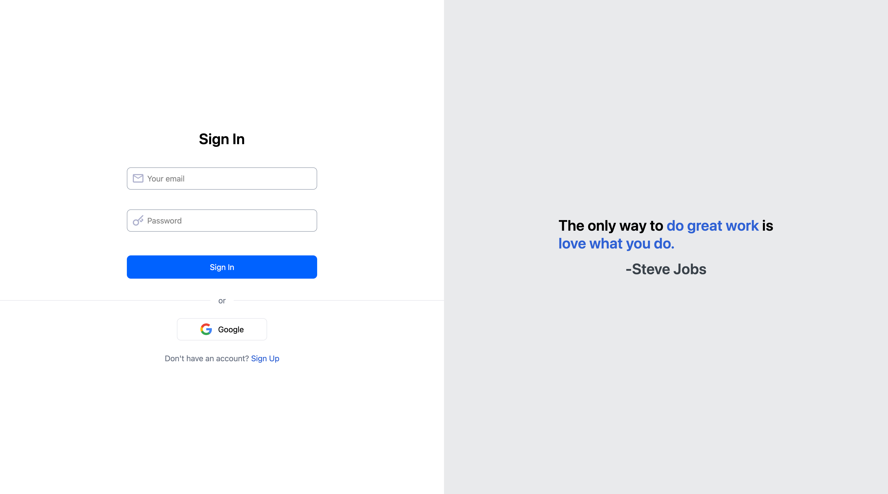
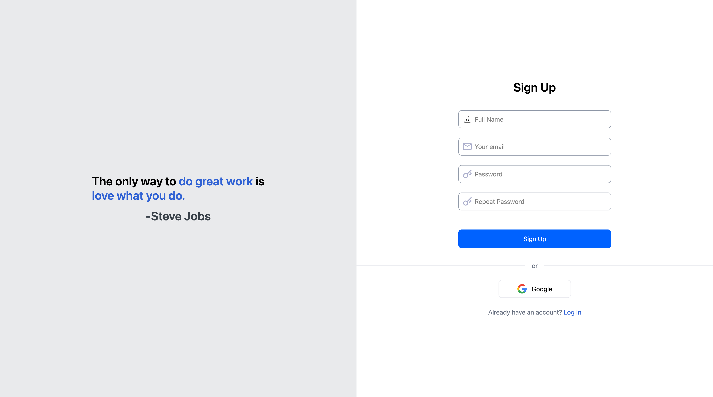
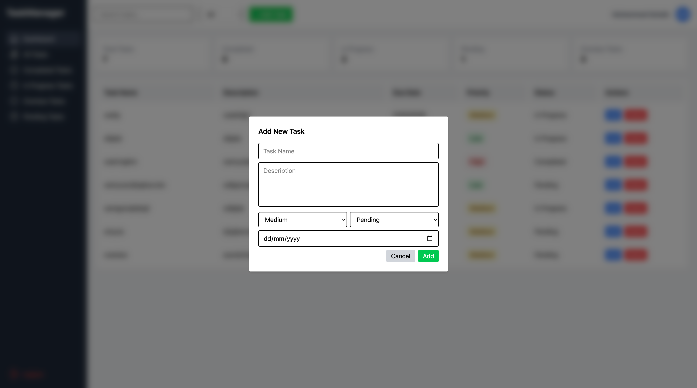

# 🚀 TaskManager – Full Stack Task Management App

A **production-ready task management web application** built with **React, Tailwind CSS, and Appwrite**, featuring secure authentication, protected routing, Google OAuth, and **full CRUD operations with Appwrite Database**.

This project demonstrates my ability to design and build **real-world SaaS-style applications** with proper authentication, database integration, and scalable component architecture.

---

## 🎯 Why This Project Matters

This is not just a UI demo.

It showcases:

* Secure authentication & session handling
* Database-backed CRUD functionality
* Role-based route protection
* Clean, modular React architecture
* Deployment-ready SPA configuration

Ideal for **startups, admin dashboards, internal tools, and MVPs**.

---

## ✨ Features

* 🔐 Email & Password Authentication (Appwrite)  
* 🔑 Google OAuth Login  
* 🛡️ Protected Dashboard Route  
* 📝 Full CRUD Operations for Tasks  
* 💾 Tasks stored in **Appwrite Database**  
* 👤 User-specific task isolation  
* 📊 Dashboard with task stats  
* 🧩 Modular, reusable components  
* ☁️ Deployment-ready on Vercel  

---

## 🧠 Technical Highlights

* React Router v6 with **ProtectedRoutes & PublicRoutes**  
* Session-based authentication handling  
* Appwrite **Accounts + Database** integration  
* Task CRUD with modal-based UI  
* Centralized auth utilities (`auth.js`)  
* Clean component separation & scalable folder structure  
* Error & loading state handling  

---

## 🛠️ Tech Stack

* **Frontend:** React, JavaScript  
* **Styling:** Tailwind CSS  
* **Routing:** React Router v6  
* **Backend / Database:** Appwrite  
* **Authentication:** Appwrite (Email + Google OAuth)  
* **Deployment:** Vercel  

---

## 📂 Folder Structure

- 📁 TaskManager/
  - 📁 src/
    - 📁 Components/
      - 🟨 ProtectedRoutes.jsx
      - 🟨 PublicRoutes.jsx
      - 🟨 Sidebar.jsx
      - 🟨 StatsCard.jsx
      - 🟨 TaskModal.jsx
      - 🟨 TaskTable.jsx
    - 📁 Pages/
      - 🟨 Dashboard.jsx
      - 🟨 Login.jsx
      - 🟨 SignUp.jsx
    - 📁 assets/
      - 📁 icons/
        - 🖼️ Google.svg
        - 🖼️ email.svg
        - 🖼️ facebook.png
        - 🖼️ facebook.svg
        - 🖼️ fullName.svg
        - 🖼️ password.svg
    - 🟨 App.jsx
    - 🟨 appwrite.js
    - 🟨 auth.js
    - 🟨 index.css
    - 🟨 main.jsx
  - 📄 .gitignore
  - 📄 README.md


---

## 🗄️ Task Management (CRUD)

* Tasks are stored in **Appwrite Database**  
* Each task is linked to the authenticated user  
* Supported operations:  

  * ➕ Create task  
  * 📄 Fetch user tasks  
  * ✏️ Update task  
  * 🗑️ Delete task  

* Secure access ensures users can manage **only their own tasks**  

---

## 🔐 Authentication & Routing Flow

| Route        | Access Type | Description       |
| ------------ | ----------- | ----------------- |
| `/`          | Public      | Login page        |
| `/signup`    | Public      | User registration |
| `/dashboard` | Protected   | Task dashboard    |

✔ Logged-in users are redirected to dashboard  
✔ Unauthorized users cannot access protected pages  

---

## 🌍 OAuth & Deployment Note

To support Google OAuth and client-side routing on Vercel, the following rewrite configuration is used:

```json
{
  "rewrites": [
    { "source": "/(.*)", "destination": "/" }
  ]
}
```
## 🖼️ Screenshots

(Add screenshots here to showcase the key features of the Task Manager)

| Feature       | Screenshot |
|---------------|------------|
| **Login Page**    |  |
| **Sign Up Page**  |  |
| **Dashboard**     |  |
| **Task Modal**    |  |


## 🚀 Live Demo

👉 [View Live Demo on Vercel (TaskManager)](https://task-manager-lake-omega-45.vercel.app/signup)  

## 💼 Value for Clients

This project demonstrates how I deliver **client-ready**, production-grade applications, including:

- Secure authentication system (email + Google OAuth)
- Database-driven interactive dashboards (Appwrite backend)
- Modern task & data management features
- Clean, responsive UI/UX with React
- Protected & public routes
- Professional component architecture
- Ready for production deployment

### I can adapt/customize this system for:

- Task & project management applications
- SaaS dashboards & analytics panels
- Admin panels & internal tools
- CRM systems
- Startup MVPs
- Team collaboration platforms

## 🤝 Let’s Work Together

I’m a **Full Stack / MERN Developer** specializing in building secure, scalable, and modern web applications.

I can help you with:

- SaaS dashboards & admin panels
- Task & project management tools
- Fast MVPs for startups
- Client-ready React + Appwrite / Firebase projects
- Full-stack development with clean, maintainable architecture

📬 **Contact me** on [Fiverr](https://www.fiverr.com/yourusername) or [GitHub](https://github.com/msochaib) for freelance projects, collaborations, or consultations.

## ⭐ Support

If you find this project helpful or inspiring, please consider giving it a ⭐ on GitHub — it means a lot!
